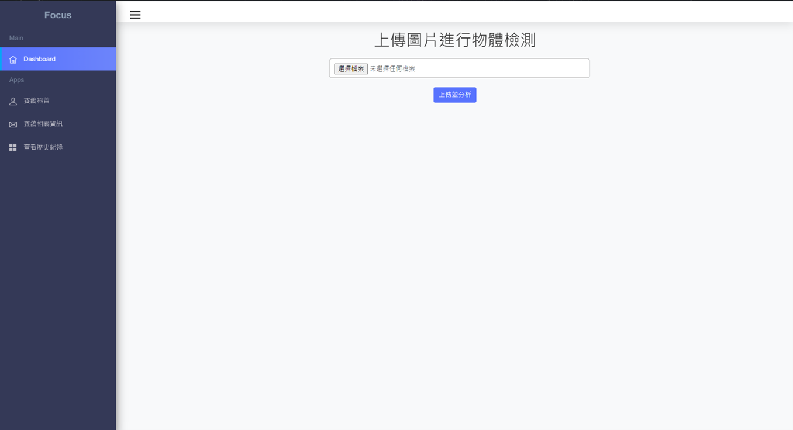
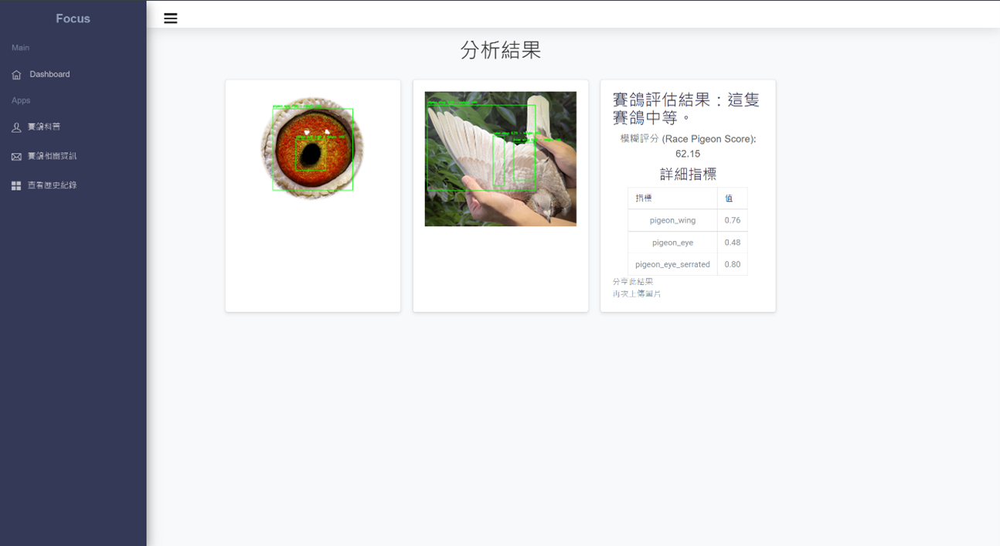
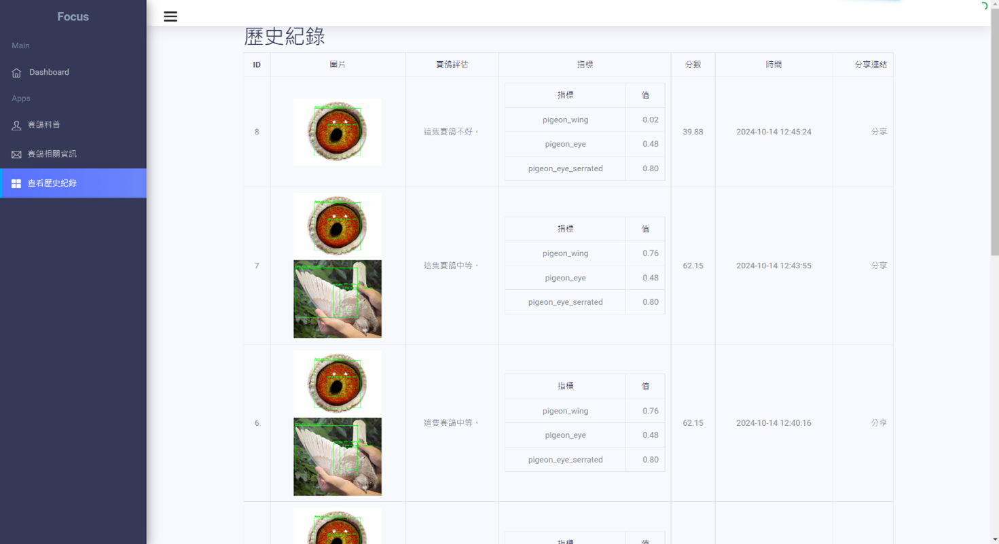
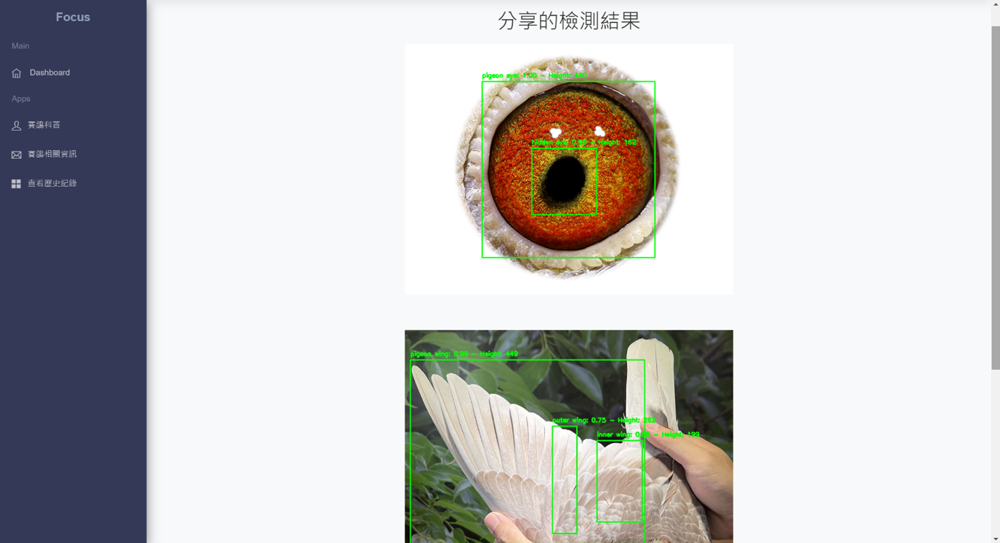

# 賽鴿辨識系統

## 項目簡介

賽鴿辨識系統是一款基於 YOLOv4-tiny 模型的物體檢測與評估工具，專為賽鴿愛好者和研究者設計。該系統能夠自動分析上傳的賽鴿圖片，檢測關鍵特徵（如翅膀、眼睛等），並通過模糊邏輯評估賽鴿的整體品質。此系統的應用場景包括賽鴿比賽前的準備、飼養管理以及賽鴿健康狀況的監控。

### 主要功能：

- 自動檢測賽鴿的關鍵特徵
- 基於模糊邏輯進行賽鴿品質評估
- 提供用戶友好的網頁介面進行圖片上傳和結果展示
- 儲存檢測歷史紀錄，方便查詢和分享

## 技術棧

本項目使用了以下主要技術、框架和庫：

- Python：主要編程語言
- YOLOv4-tiny：物體檢測模型
- Flask：Web 框架，用於構建後端服務
- OpenCV：圖像處理庫
- SQLite：輕量級資料庫，用於儲存檢測歷史紀錄
- Pyngrok：建立公開的 ngrok 隧道，讓本地服務可公開訪問
- skfuzzy：模糊邏輯控制系統
- Mediapipe：圖像分析和處理工具
- Google Colab：運行和訓練模型的雲端平台

## 安裝指南

以下步驟將指導您如何在 Google Colab 環境中設置並運行賽鴿辨識系統。

### 前置要求

- Google 帳號：訪問和運行 Google Colab。
- ngrok 帳號：用於建立公開的 ngrok 隧道（[註冊 ngrok](https://dashboard.ngrok.com/sign-up)）。
- Git：用於克隆倉庫（可選，因為在 Colab 中可以直接上傳文件）。

## 使用說明

以下步驟將指導您如何使用賽鴿辨識系統進行物體檢測和品質評估。

### 1. 下載程式

- 下載賽鴿辨識.ipynb 檔
- 運行賽鴿辨識.ipynb 檔

#### 賽鴿辨識.ipynb 的主要功能：

- 提供首頁供用戶上傳圖片
- 處理圖片上傳並進行物體檢測
- 顯示檢測結果和品質評估
- 儲存檢測歷史紀錄於 SQLite 資料庫

### 2. 訪問應用

公開訪問（使用 ngrok）：在啟動 ngrok 隧道後，通過 Colab 的輸出中提供的公開 URL 訪問應用。例如：https://abcd1234.ngrok.io

### 3. 上傳圖片進行物體檢測

首頁界面：

#### 上傳圖片：

- 點擊「選擇文件」按鈕，選擇要上傳的賽鴿圖片（支援 PNG、JPG、JPEG 格式）。
- 點擊「上傳並分析」按鈕，系統將自動處理上傳的圖片。

#### 查看檢測結果：

- 顯示檢測到的圖片及其標註結果。
- 展示賽鴿的品質評估結果和詳細指標。
- 提供分享連結，方便用戶分享檢測結果。

### 4. 查看歷史紀錄

歷史紀錄界面：

#### 功能說明：

- 列表顯示所有過去的檢測紀錄。
- 每條紀錄包含檢測圖片、評估結果、詳細指標和評分。
- 提供分享連結，方便用戶分享特定的檢測結果。

### 5. 分享檢測結果

分享頁面：

#### 功能說明：

- 通過分享連結，用戶可以將檢測結果分享給他人。
- 分享頁面顯示檢測圖片、評估結果及詳細指標。
